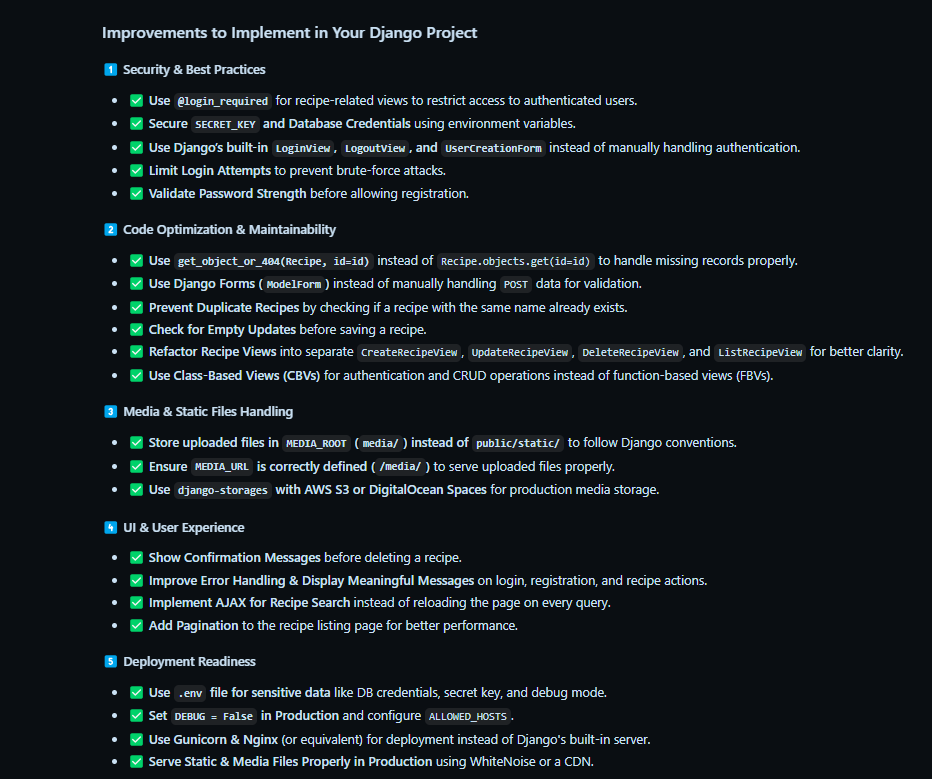

# FlavorFrame

FlavorFrame is a Django-based recipe-sharing application that allows users to upload, update, and delete recipes with images. The application features user authentication and a Bootstrap-powered frontend.

## Features
- **User Authentication**: Secure login/logout functionality.
- **Recipe Management**: Users can create, update, and delete recipes.
- **Image Upload**: Recipes can include images.
- **MySQL Database**: Uses MySQL for data storage.
- **Bootstrap UI**: Responsive and user-friendly design.

## Installation

### Prerequisites
Ensure you have the following installed:
- Python (>= 3.x)
- MySQL
- Virtual Environment (Recommended)

### Setup
1. Clone the repository:
   ```sh
   git clone https://github.com/yourusername/flavorframe.git
   cd flavorframe
   ```

2. Create and activate a virtual environment:
   ```sh
   python -m venv venv
   source venv/bin/activate  # On macOS/Linux
   venv\Scripts\activate     # On Windows
   ```

3. Install dependencies:
   ```sh
   pip install -r requirements.txt
   ```

4. Configure the database:
   - Create a MySQL database.
   - Update `settings.py` with your database credentials.

5. Apply migrations:
   ```sh
   python manage.py migrate
   ```

6. Create a superuser (optional):
   ```sh
   python manage.py createsuperuser
   ```

7. Run the development server:
   ```sh
   python manage.py runserver
   ```

## Deployment
- Ensure `DEBUG=False` in `settings.py` before deploying.
- Use a production-ready WSGI server like Gunicorn.
- Set up static file hosting.

## Contributing
Feel free to fork the repository and submit a pull request.




