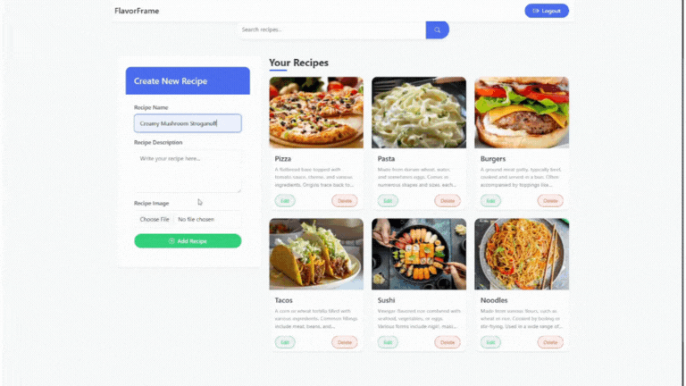
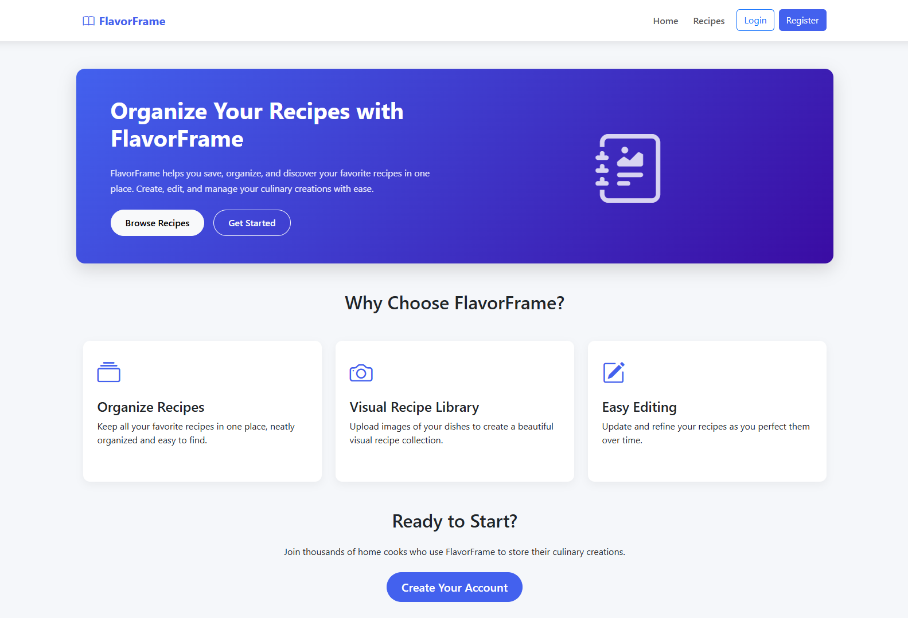
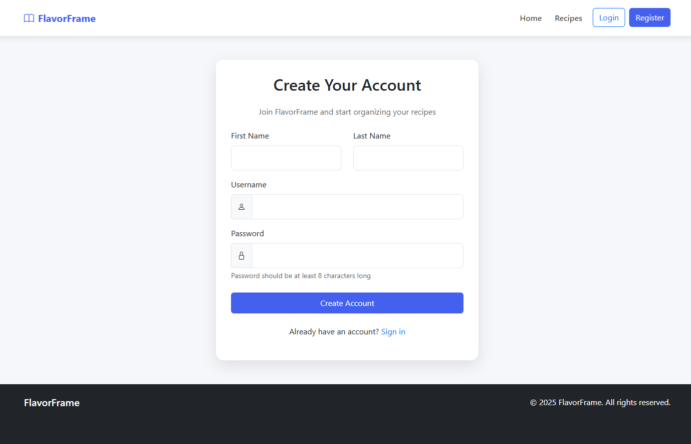
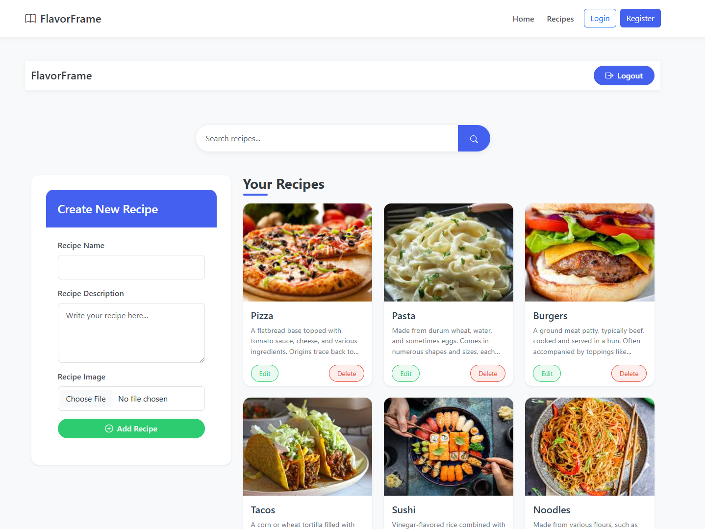
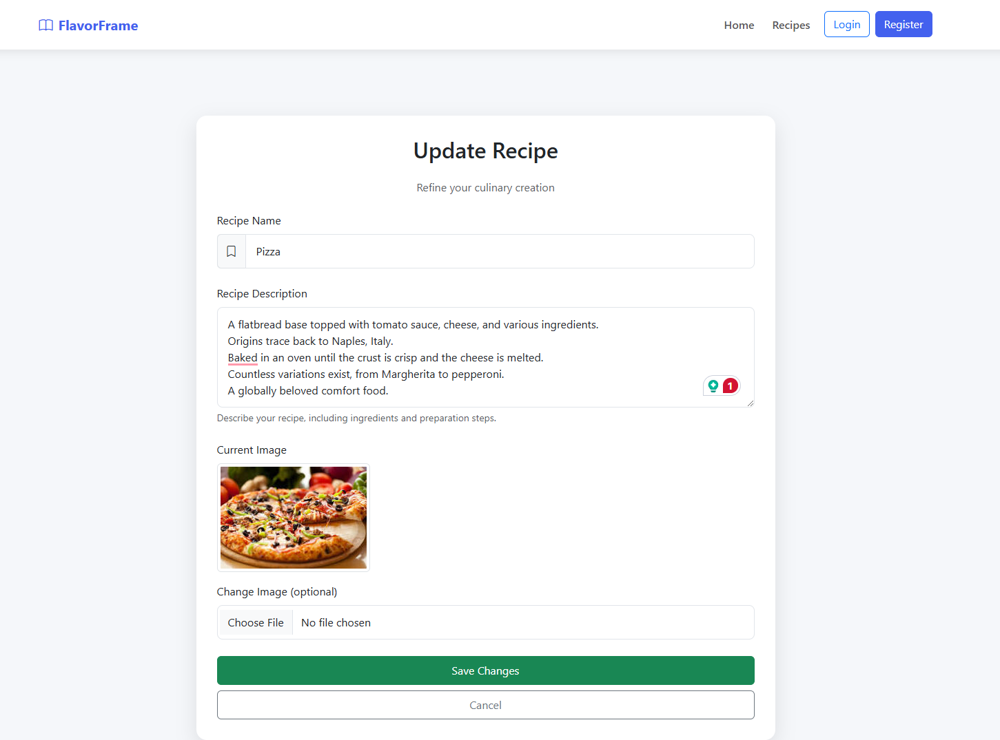

# 🍽️ FlavorFrame - Recipe Management Application

Welcome to FlavorFrame, a recipe management application I built using Django! This project allows users to create, manage, and organize their favorite recipes with ease. I wanted to create a platform where users could store recipes digitally with images and access them from anywhere. FlavorFrame provides a simple yet effective way to build your own personal cookbook.

[](https://flavorframe.vercel.app/)
## 🛠️ Tech Stack

| Technology | Name |
|------------|------|
|  | HTML5 |
|  | CSS3 |
|  | Bootstrap 5 |
|  | Django 5.1.3 |
|  | SQLite (dev) |
|  | PostgreSQL (prod) |
|  | Cloudinary |
|  | Vercel |
|  | Git |
|  | GitHub |

## 📁 Project Structure

```
FlavorFrame/
├── core/                 # Django project configuration
│   ├── settings.py       # Settings including database & Cloudinary config
│   ├── urls.py           # URL routing
│   └── wsgi.py           # WSGI configuration
├── FlavorFrame/          # Main application
│   ├── migrations/       # Database migrations
│   ├── templates/        # HTML templates
│   ├── models.py         # Data models (Recipe)
│   └── views.py          # View functions
├── home/                 # Home application
│   ├── templates/        # Home page templates
│   └── views.py          # Home views
├── media/                # Local media storage (development)
├── .gitignore            # Git ignore file
├── requirements.txt      # Project dependencies
├── manage.py             # Django management script
└── vercel.json           # Vercel deployment configuration
```

## ✨ Features

- **🔐 User Authentication**: Register, login, and secure account management
- **📝 Recipe Management**: Create, read, update, and delete recipes
- **🖼️ Image Upload**: Add images to recipes using Cloudinary integration
- **📱 Responsive Design**: Mobile-friendly interface built with Bootstrap

## 📸 Application Pages

### Home Page


### Login Page


### Registration Page


### Recipes Dashboard


### Add/Edit Recipe Page


##  Setup Guide

### Local Development

1. **Clone the repository**
   ```bash
   git clone https://github.com/yourusername/FlavorFrame-Django-Authenticated.git
   cd FlavorFrame-Django-Authenticated
   ```

2. **Create a virtual environment**
   ```bash
   python -m venv venv
   venv\Scripts\activate  # Windows
   # source venv/bin/activate  # macOS/Linux
   ```

3. **Install dependencies**
   ```bash
   pip install -r requirements.txt
   ```

4. **Set up environment variables**
   Create a `.env` file in the project root with:
   ```
   SECRET_KEY=your_secret_key
   DEBUG=True
   ```

5. **Run migrations**
   ```bash
   python manage.py migrate
   ```

6. **Start the development server**
   ```bash
   python manage.py runserver
   ```

7. **Access the application**
   Open http://127.0.0.1:8000/ in your browser

### ☁️ Cloudinary Setup

1. **Create a Cloudinary account**
   - Sign up at [cloudinary.com](https://cloudinary.com/)
   - Note your cloud name, API key, and API secret

2. **Add Cloudinary credentials to your `.env` file**
   ```
   CLOUDINARY_CLOUD_NAME=your_cloud_name
   CLOUDINARY_API_KEY=your_api_key
   CLOUDINARY_API_SECRET=your_api_secret
   ```

### 🚢 Deployment to Vercel

1. **Create a PostgreSQL database on Render**
   - Sign up at [render.com](https://render.com/)
   - Create a new PostgreSQL database
   - Note the connection details

2. **Create a Vercel account and install Vercel CLI**
   ```bash
   npm install -g vercel
   ```

3. **Run migrations on your production database**
   Temporarily update your `settings.py` to connect to your Render database and run:
   ```bash
   python manage.py migrate
   ```

4. **Configure Vercel deployment**
   - Create `vercel.json` in your project root
   - Add environment variables in the Vercel dashboard:
     - DB_NAME, DB_USER, DB_PASSWORD, DB_HOST, DB_PORT
     - CLOUDINARY credentials
     - SECRET_KEY

5. **Deploy to Vercel**
   ```bash
   vercel
   ```

## 🧩 Challenges and Solutions

One of the major challenges I faced during this project was deploying to Vercel with a working database connection. The serverless nature of Vercel created several obstacles:

1. **SQLite Database Issues**: Initially, I tried to use SQLite, but Vercel's read-only filesystem prevented write operations to the database file.

2. **MySQL Connection Problems**: Next, I attempted to use MySQL, but had connectivity issues from Vercel's environment.

3. **PostgreSQL Integration**: Finally, I set up a PostgreSQL database on Render and configured Django to connect to it when running on Vercel.

4. **Migration Challenges**: The most persistent issue was getting database migrations to run on the production database. The error logs from Vercel were crucial in diagnosing that tables weren't being created.

I enjoyed the deployment process despite the challenges. Working through error after error in the Vercel logs, I gained a deeper understanding of how Django connects to databases in different environments. When I finally identified that the missing database tables were the root issue, the relief was immense! This experience taught me so much about cloud deployment and database configuration.

## 🚀 Future Improvements

I have several ideas to enhance FlavorFrame in the future:

- **🏷️ Recipe Categories**: Add the ability to categorize recipes (desserts, main dishes, etc.)
- **🔍 Search Functionality**: Implement a robust search feature to find recipes by ingredient or name
- **👤 User Profiles**: Create public/private user profiles with avatar images
- **🔗 Recipe Sharing**: Allow users to share recipes with others via links or social media
- **⭐ Rating System**: Add the ability for users to rate their own recipes or favorites
- **🔄 API Integration**: Connect with external recipe APIs to import recipes
- **📅 Meal Planning**: Add calendar integration for meal planning
- **🛒 Shopping List**: Generate shopping lists based on selected recipes
- **⚖️ Recipe Scaling**: Add functionality to scale recipe ingredients up or down

## 💻 Possible Technical Improvements

- **🧪 Add Testing**: Implement unit and integration tests
- **⚡ Implement Caching**: Use Redis for improved performance
- **🖼️ Optimize Images**: Add automatic image optimization
- **🔄 Add CI/CD**: Set up continuous integration and deployment
- **🔌 Refactor to DRF**: Convert to Django Rest Framework for a more robust API
- **⚛️ Frontend Framework**: Integrate React or Vue for a more dynamic UI

---

I hope you enjoy exploring FlavorFrame as much as I enjoyed building it! If you have any questions or suggestions, please feel free to reach out or open an issue on GitHub.

Feel free to create a pull request if you'd like to contribute to FlavorFrame. Thank you for checking out my project! 🙏